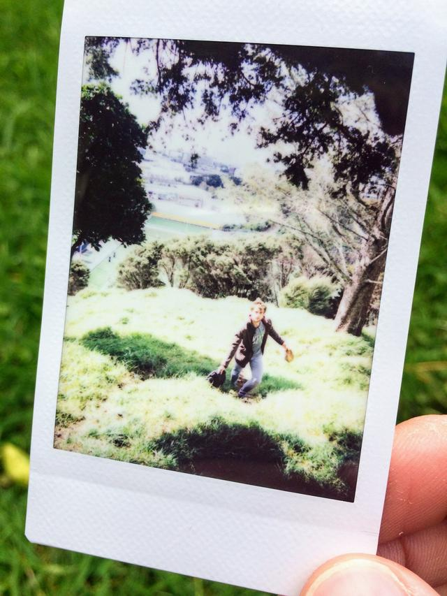

One of my goals for 2017 is to take an instant film photograph every single
day.

Yesterday I had lunch at one of my favourite places in Mt Eden - on the actual
mountain bit, not the suburb. As I was leaving I captured this photo of myself
walking up a hill.

I hung the camera in a nearby tree and set the timer before rushing back to get
in position. It was quite by luck that I happened to line up the camera so that
I was on the rule-of-thirds grid mark.

I really like how there is quite a lot going on in this photo, with the
silhouettes of scraggly branches at the top, the tree trunk in the sun on the
right, and the bushy leaves in the shadows on the dark, the washed out city in
the background, the scrub in the mid ground, me wandering around in the
foreground, and the blown out highlights of the tall grass around me.

