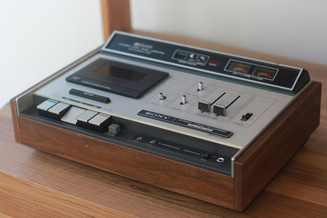
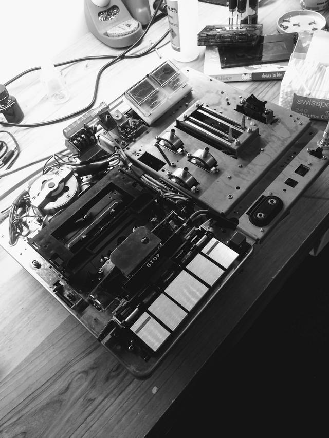
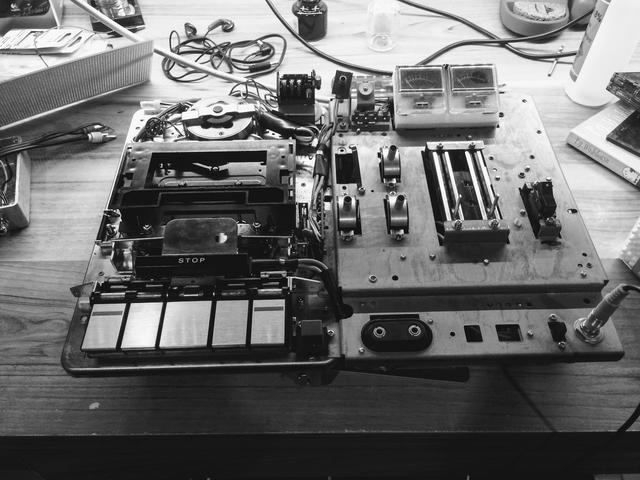

I quite like cassette tapes - particularly recording mixtapes.

I acquired a 1970's Sony cassette deck earlier this year - I chose this
one because of it's gorgeous wooden plinth and top-loading cassette tray.

It plays back fine, and sounds pretty good for it's age. 

However, earlier today, the play button stopped working - I physically couldn't
depress the switch anymore. I removed the top and bottom covers to reveal the
complex inner workings.

It turned out that the metal flap above the stop button had been slightly
raised and was catching on the chassis. By gently pressing it I was able to fix
the cassette deck. I think the cause of this is that the eject mechanism is
quite powerful - and the force of the tray quickly opening may have jossled the
components around enough.

