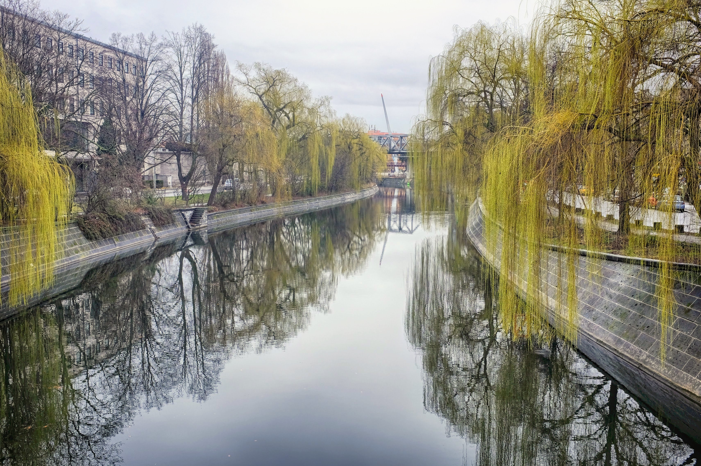
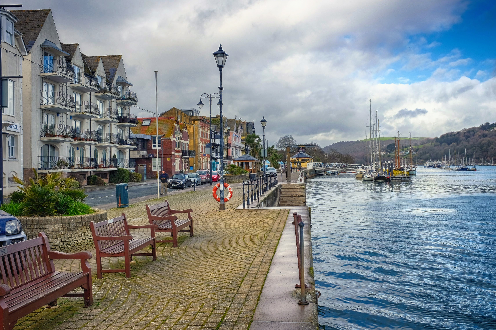
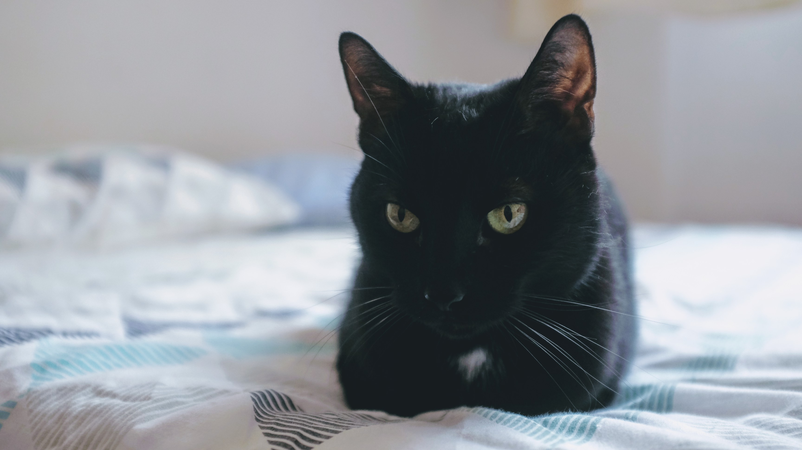
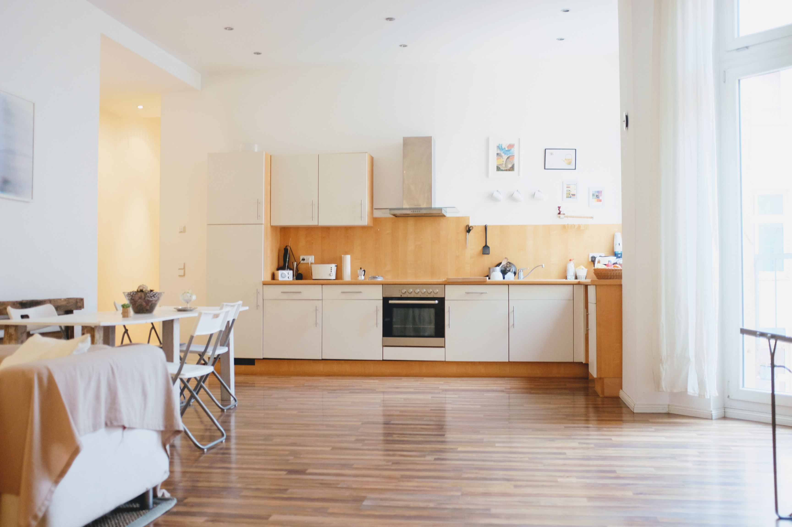

Song: Big Red Machine - Gratitude.

After today I will have been in Berlin for one week.

I packed my bags and checked out of my first AirBnB at 11am, and can check in
to my next AirBnB at 3pm.

It's a cold day, but I have my scarf, jersey and jacket so I'll be fine. I can
visit a cafe while I pass the time.

However, today is Sonntag (Sunday). What I had forgotten about Berlin is that
today most of the shops are closed, including cafes. They take the day of rest
seriously here. 

So I wandered around for a bit and after a while found a good place to sit by
the canal. One thing I miss about small English towns is the sheer abundance of
benches.

This was fine until it started to rain down. I found a cafe in Kreuzberg that
was open, simply called "Cafe & bäckerei". They served Turkish tea and tasty
baguettes. This was my first time ordering at a cafe by myself, and it went
pretty well, even though they had to pour my tea again because someone else
claimed the first one.

I tried to do some work on
[plextools](https://github.com/stayradiated/plextools) but for some reason my
Vodafone UK sim doesn't seem to let me tether it to my laptop, which is a bit
of a shame. I'll need to pick up a German SIM card sometime this month.

I checked in to my week 2 AirBnB and met Pietro and his cats Klaus and Franz.
His cats are very friendly but are also very smart. I didn't believe it when
Pietro said they could open doors (by jumping and grabbing the handle!), but
I've witnessed it a few times now. This means if I want to keep my room cat
free I need to lock my door - luckily they haven't figured out how to use the
key yet. 

For dinner I made pasta with pesto and cheese again. This is the fifth time in
the past seven days that I've had pasta with pesto and cheese for dinner. I
really need to try something new tomorrow. 

The lounge/kitchen in this AirBnB is very spacious.

