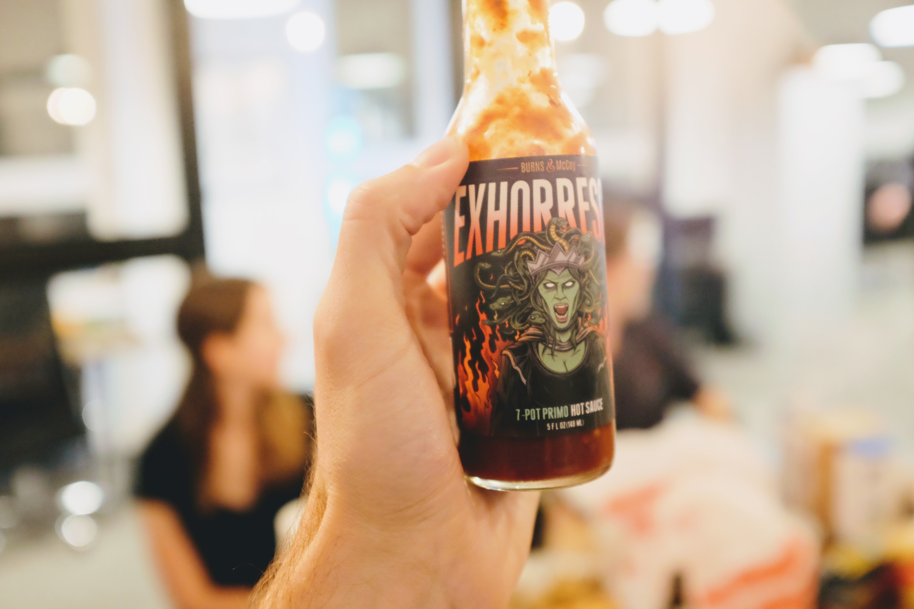
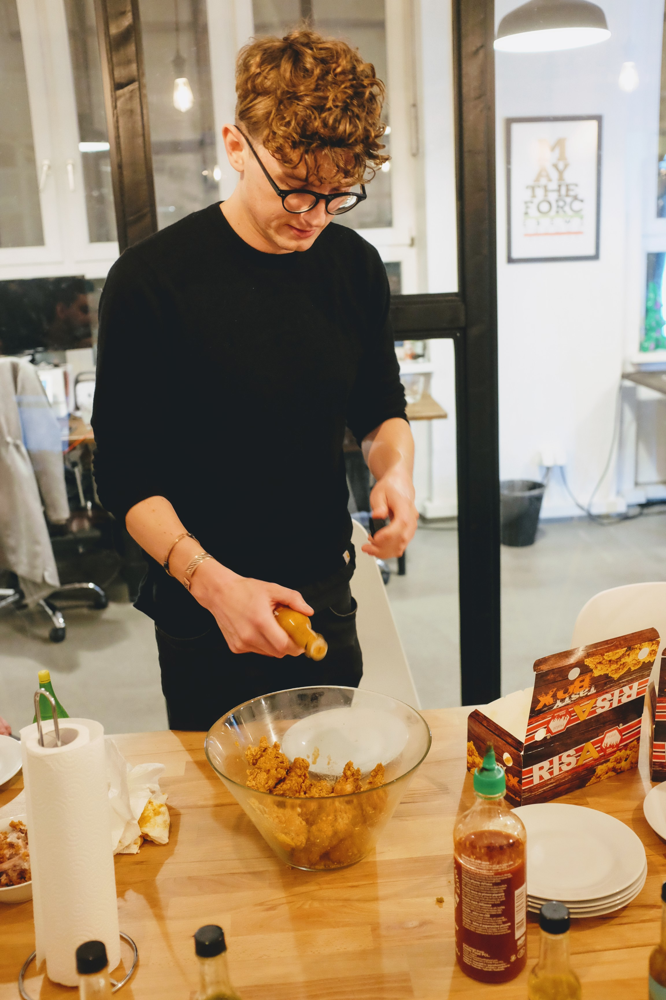

Jacob is a big fan of the YouTube channel Hot Ones - a TV show where
celebrities are invited to eat a series of chicken wings dipped in incredibly
spicy hot sauce while also being interviewed. The hot sauces start off on the
low end, and get increasingly spicier, finishing with the spiciest hot sauce in
the world.

The sauces are available for sale online, and Jacob ordered all 10 used on the
show. He planned a night where everyone in the team could join in and eat a
wing tossed in each of different sauces.

Tonight was that night.

We ordered an obscene amount of chicken wings, enough for everyone to try each
suace, and more. The sauces were lined up in the same order of the show.
Glasses of milk and water were made available, along with bread and chips, and
anything else we thought might calm our mouths down afterwards.

We started out with first sauce, a mere 1,700 Scovilles. Benni would read out a
quiz question then we would all eat our wing and the first person to finish
eating and then the answer the question would get points.

It started out pretty well. We got halfway through the sauces (around 60,000
Scovilles) and we all felt pretty good about ourselves for making it that far,
and agreeing that it wasn't as hot as we thought it would be. We also discussed
the different flavours we could taste and any sauces we found particularly
tasty.

That was when we came across Sauce #7.

I tipped the wings into the bucket, doused them in the sauce and gave it a good
toss in the air to even it out. The bucket was passed around, and everyone had
a wing in their hand. Benni read out the quiz question and we sunk our teeth
in...

This hot sauce was on another level, a level that was far far spicier than
anything we had tried before. It started with a slow burn in the back of your
throat, but quickly inferno'd out to the tip of your tounge. You could feel the
sharp stinging burn as it injected itself into your gums, and the throbbing
heat as it sank into your lips. Eyes were watering, loud breaths were exhaled,
milks was gulped. 

But we finished our wings and pushed on. After that there were still spicier
sauces, but it seemed we had crossed the maximum pain threshold and it didn't
matter how many Scovilles were inflicted on us now, it couldn't get any worse.
Even The Last Dab, the hottest sauce in the world at over 2,000,000 Scovilles
seemed underwhelming in comparison. I would like to try it again by itself, I
am sure it would be a very different experience.

