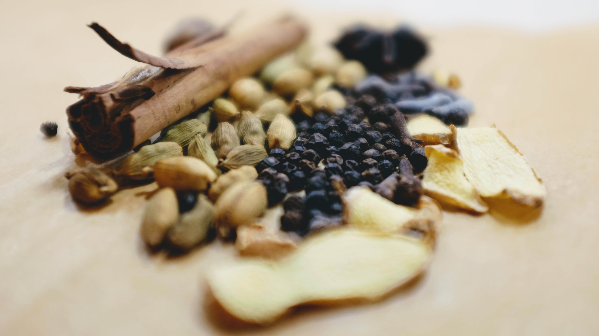

Last night I had dinner at Jacob and Alex's place. Jacob cooked a fantastic
Palak Paneer curry, Alex served us some delicious cocktails, and for a desert I
made a tasty chai tea.

This is the first time I've made Rooibos chai. I wanted to use Rooibos because
it doesn't contain any caffeine. The chai tea turned out so well I thought I
better write down the recipe. 

# Chai Tea Recipe

> Serves 3 people

## Ingredients

- Five **Rooibos Tea Bags** (you just want plain Rooibos)
- A lot of **Cardamom Pods** (this is the best spice)
- A handful of **Cloves** (about 2/3 the ratio of Cardamom)
- A good amount of **Peppercorns** (but not too many)
- A sprinkling of **Coriander Seeds**
- One **Cinnamon Stick** (you could probably even do two)
- One whole carton of **Full Milk**
- Two spoonfuls of **Honey**

## Spice Mix

1. Using a mortar & pestle, crush the **cardamom pods** up. Remove all of the
   husks, and continue crushing the seeds up as much as you can.
2. Throw in the **cloves**, and crush away.
3. Add in the **peppercorns**, and keep crushing.
4. Sprinkle in a few **coriander seeds**, and crush those as well.
5. Finally add in a **cinnamon stick** or two, and smash it to smithereens.

## Tea time

1. Fill a pot with **milk** and place it on a high heat.
2. Add **Rooibos tea bags**.
3. After the milk has warmed up a bit, add the **spice mix**.
4. Stir constantly to stop the milk sticking to the bottom of the pot.
5. You don't want to let the milk boil. As soon as it starts to bubble, turn
   the element off and place a lid on the pot.
6. Leave the milk to simmer for a bit, and then move it to a different element.
7. Add the **honey**.
8. Let it sit for 15 - 20 minutes.

## Serving

1. Get another pot, and a strainer. Pour the tea through the strainer into the
   pot.
2. Get three mugs, and pour the milk into each mug. 
3. Enjoy!
