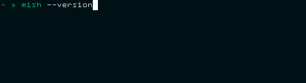

On Friday morning I updated one of my favourite libraries:  `selfupdate`. It's
open source, and you can find the code at
https://github.com/mishguruorg/selfupdate

At Mish, I started this project for use with our 'autologin' devices. These are
Raspberry Pi's we have scattered around the world that run a Node.js script.
Before "selfupdate" was a thing, managing this fleet of Pi's was a pain. To
install updates, we would have to manually SSH into each device and run the
update script. This was improved a bit by using
[Balena.io](https://www.balena.io/), but still involved a lot of work. 

I thought it would be great if the Pi's could just keep themselves up to date,
without any human intervention. Whenever someone published a new version of the
code to NPM, the device should automatically detect that, and install the
latest version. It could then need to restart it's own process so that the new
code would be running and not the old code. 

Thus "selfupdate" was born. A small package with just three functions, designed
to be used together to work wonders.

- `fetchLatestPackageVersion`
- `installPackageVersion`
- `respawnProcess`

This made our lives a lot easier, and we moved on to other challenges.

At Mish we build a lot of our own CLI tools. We are continually adding features
and fixing bugs and releasing new versions. It's fantastic. However, we also
have quite a few developers, and not everyone is going to update to the latest
version immediately. This means a most people are running an older version of a
tool - sometimes this just means they miss out on the cool new features, but
other times it could actually cause problems if the tool interacts with our
database in the wrong way.

I've seen a few people in the team use `npx` - which is a great way to
install/use CLI tools. However, not everyone is using `npx` and even those that
do find it annoying to have to wait for it to install the package everytime.

I thought it would be great if our tools could just keep themselves up to date
whenever we used them, so that everyone in the team would always be running the
latest version. I thought that the "selfupdate" library would be just the thing
for implementing this.

I added a new fourth function, which wraps the other three.  You simply pass it
the contents of your projects `package.json` and it will make sure your app is
up to date. It's really simple to use:

``` javascript
const { selfupdate } = require('@mishguru/selfupdate')
const pkg = require('../package.json')

const start = () => {
  await selfupdate(pkg)

  // ... your app starts here
}

start().catch(console.error)
```

When your app starts, it automatically checks for a new version on NPM. If it
finds a new version, it will install it globally and then respawn seamlessly
inside the same process.



When checking for a new version at startup, the user will sometimes notice the
delay - this is not desirable, especially if it happens every time the app
runs. To resolve this, "selfupdate" only checks NPM once every hour. This can
be customised, but I thought it was a good balance between rolling out a new
version as soon as possible, and keeping the user experience responsive. 

I'm currently upgrading all our tools to use "selfupdate", and I'm hoping that
this will help the team and minimise issues caused by old tools. The only
trouble is, I have to make sure everyone updates their tools just once more,
because the old versions aren't self updating :)
