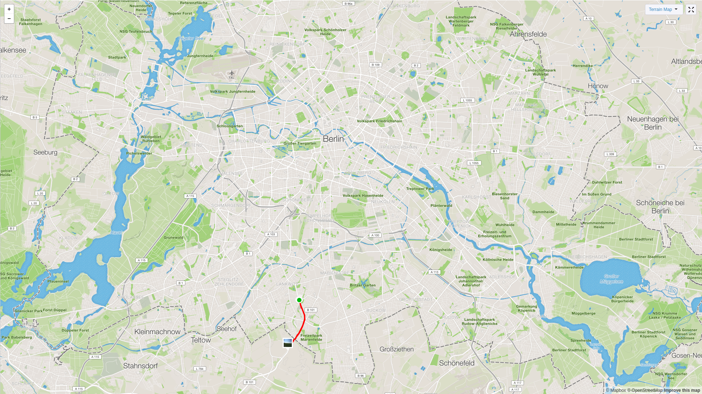
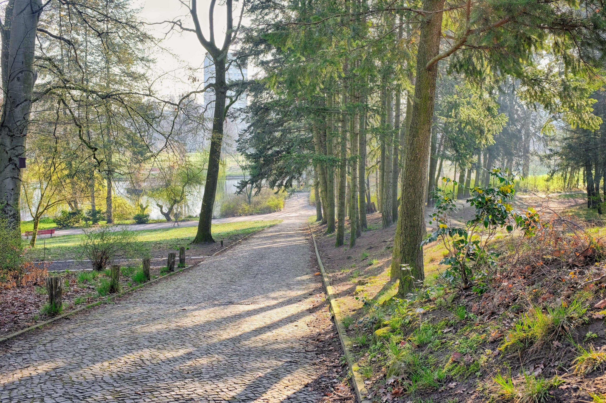

I finally bought a pair of running shoes in Berlin today. It's something I've
been meaning to do since I got here nearly a month ago, but I've never seemed
to have the time. Last weekend I made my way to "Lunge der Laufladen", but only
had 10 minutes before they closed, which wasn't nearly enough time to pick out
a pair of shoes. This afternoon I returned just after midday, and tried out
several different types of shoe.

I quite like the Nike LunarGlide 8 shoes - I owned a pair back in New Zealand
and found them to be quite comfortable, lightweight and stable. It has since
been replaced by the Nike LunarGlide 9, but unfortunately Nike don't seem to be
making them any more. The running shop had some old stock, but not in my size.

However, there is the Nike LunarGlide 8 Shield - which is pretty much the same
shoe except it has a different colour scheme and has a water-repellent top bit.
They cost me 90€ (~ $150) which is pretty pricey, but I expect that they will last
me a good 400km or so. 

I went for a run shortly after, my first in over a month! It felt great to get
some proper outdoor exercise, especially today as the sun was shining bright
and there were few clouds to be seen.

I'm currently staying in Lankwitz, which is right at the south border of
Berlin. It's very flat (like most of Berlin) and I just ran along the concrete
footpath, following the main road south. I actually ended up leaving Berlin,
and entered into Brandenburg, which is the state that surrounds Berlin. 

I normally run around 8 - 10km, but decided since it had been a while, and
these are new shoes I shouldn't overdo it, so today I ran only 6.6km. I did
keep up a decent pace of 4:03/km. Tomorrow I plan to go for a morning run, this
time heading north and through the gorgeous community park.

