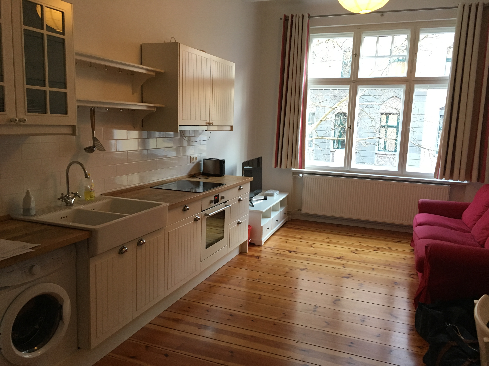
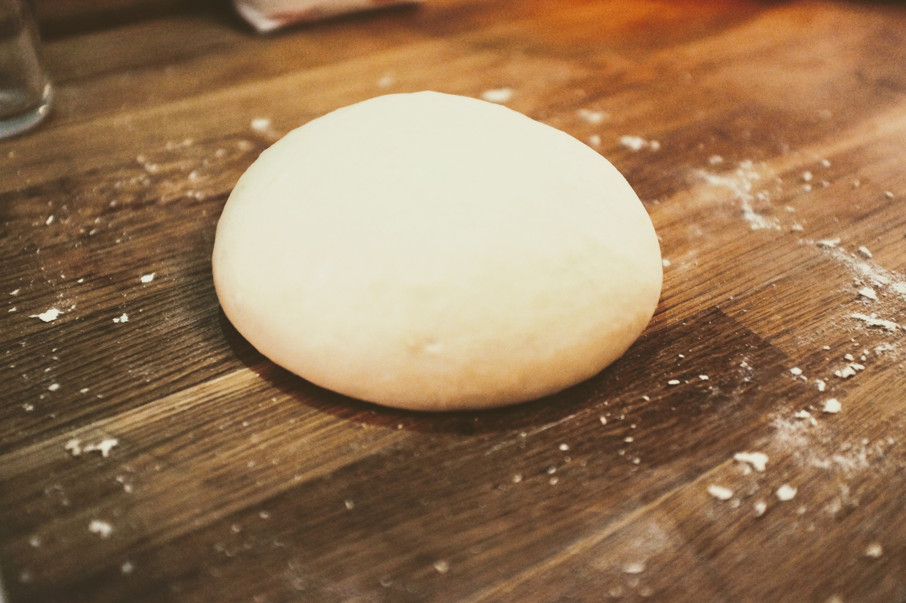
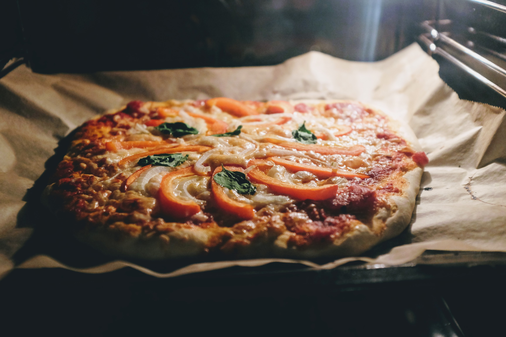
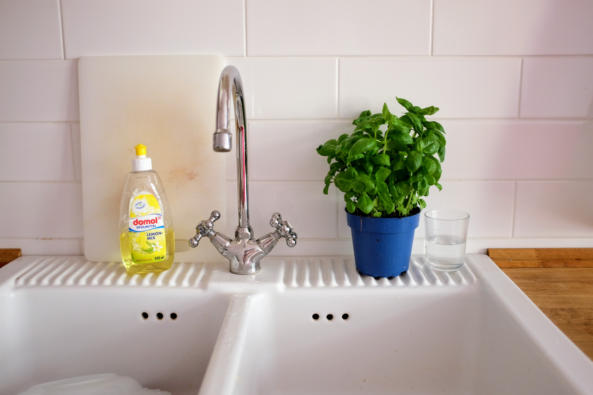

I moved into my new apartment on Monday. It's a cute little place - I'm
renting it for a month through Wunderflats. It has a pretty neat kitchen, so
I'm planning to do a lot of cooking while I'm here.

I made pizza for dinner last night, and it turned it really well so I made it
again tonight.  For the bases I've been using this [Homemad Thin-Crust
Pizza](https://www.thekitchn.com/recipe-homemade-thin-crust-pizza-recipes-from-the-kitchn-45499)
recipe, which I really like because it's quick, easy and tastes pretty good.

I didn't have any ingredients so I had to go to supermarket. I wanted to pick
up some all purpose flour, but it was surprisingly difficult to find. The flour
here has a number, such as 405, 550, 812 etc, and I had no idea what it meant.
Luckily I found [this article about how flour works in
Germany](https://www.noordinaryhomestead.com/flour-in-germany-not-as-easy-as-it-seems/)
and decided on Weizenmehl Type 405 - a very fine white flour.

I also needed yeast (BackHefe), as well as some baking paper
(Backpapier-Rolle), some pizza sauce and cheese (Pizza Käse), as well as some
salt (Salz). There were so many varieties of salt available, such as JodSalz
and TafelSalz and they came in all sorts of packets - I ended up selecting a
container of sea salt (Meersalz). 

The recipe I used makes enough dough for two large pizza bases, or four small
pizza bases.

For the topping, I chose to:

1. Drizzle a spoonful of olive oil on and spread it around
2. Place a few dollops of pizza sauce and try to cover as much as possible
3. Generously cover in grated cheese
4. Cut a brown onion in half, and slice thinly. Sparingly place strands of
   onion on top of the cheese
5. Slice or dice up a red capsicum, and place pieces on top without them
   overlapping.

I would then place the pizza in the oven for around 8 minutes, at which point
I added a few leaves of basil, and let it cook few a few more minutes before
taking it out to cool off.

As an added bonus, I now also have a Basil plant in the kitchen. :)

