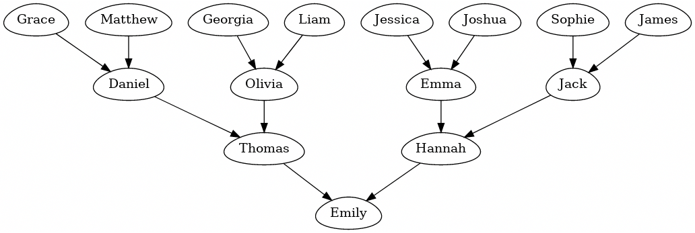
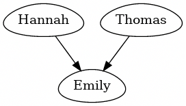

I recently subscribed to the
[dailycodingproblem.com](https://www.dailycodingproblem.com).  Every morning
  they send out a coding challenge based on an interview question. The challenges don't take that long to solve - but I find I often learn something along the way.

Here is my take on solving todays challenge.

## The Challenge

> Implement locking in a binary tree. A binary tree node can be locked or
  unlocked only if all of its descendants or ancestors are not locked.
>
> Design a binary tree node class with the following methods:
>
> - `is_locked`, which returns whether the node is locked
>
> - `lock`, which attempts to lock the node. If it cannot be locked, then it
  should return false. Otherwise, it should lock it and return true.
>
> - `unlock`, which unlocks the node. If it cannot be unlocked, then it should
  return false. Otherwise, it should unlock it and return true.
>
> You may augment the node to add parent pointers or any other property you
  would like. You may assume the class is used in a single-threaded program, so
  there is no need for actual locks or mutexes. Each method should run in O(h),
  where h is the height of the tree.

## What is a Binary Tree?

I don't come across Binary Tree's that often in web development, so I had to
  look up the definition [on Wikipedia](https://en.wikipedia.org/wiki/Binary_tree)...

> In computer science, a binary tree is a tree data structure in which **each
  node has at most two children**, which are referred to as the left child and
  the right child.

So, it's like an upside down ancestry chart.

[](https://edotor.net/#digraph%20%7B%0A%20%20node%5Bshape%3Degg%5D%0A%0A%20%20f0%20%5Blabel%3D%22Grace%22%5D%0A%20%20f1%20%5Blabel%3D%22Georgia%22%5D%0A%20%20f2%20%5Blabel%3D%22Sophie%22%5D%0A%20%20f3%20%5Blabel%3D%22Jessica%22%5D%0A%20%20f4%20%5Blabel%3D%22Olivia%22%5D%0A%20%20f5%20%5Blabel%3D%22Emma%22%5D%0A%20%20f6%20%5Blabel%3D%22Hannah%22%5D%0A%20%20f7%20%5Blabel%3D%22Emily%22%5D%0A%0A%20%20m0%20%5Blabel%3D%22Matthew%22%5D%0A%20%20m1%20%5Blabel%3D%22Liam%22%5D%0A%20%20m2%20%5Blabel%3D%22James%22%5D%0A%20%20m3%20%5Blabel%3D%22Joshua%22%5D%0A%20%20m4%20%5Blabel%3D%22Daniel%22%5D%0A%20%20m5%20%5Blabel%3D%22Jack%22%5D%0A%20%20m6%20%5Blabel%3D%22Thomas%22%5D%0A%0A%20%20%7Bf0%20m0%7D%20-%3E%20m4%0A%20%20%7Bf1%20m1%7D%20-%3E%20f4%0A%20%20%7Bf2%20m2%7D%20-%3E%20m5%0A%20%20%7Bf3%20m3%7D%20-%3E%20f5%0A%0A%20%20%7Bf4%20m4%7D%20-%3E%20m6%0A%20%20%7Bf5%20m5%7D%20-%3E%20f6%0A%0A%20%20%7Bm6%20f6%7D%20-%3E%20f7%0A%7D%0A)

## Initial class

Let's start building out our Binary Tree class. This isn't going to support
  locking yet, but it will have the required methods.

```typescript
class BinaryTreeNode<Value> {
  public readonly value: Value

  public readonly left?: BinaryTreeNode<Value>
  public readonly right?: BinaryTreeNode<Value>

  public constructor (
    value: Value,
    left?: BinaryTreeNode<Value>,
    right?: BinaryTreeNode<Value>,
  ) {
    this.value = value
    this.left = left
    this.right = right
  }

  public isLocked () {
    // renamed from is_locked because we are using camelCase for consistency.
    // todo
    return false
  }

  public lock () {
    // todo
    return false
  }

  public unlock () {
    // todo
    return false
  }
}
```

We can use it like this:

```typescript
const Hannah = new BinaryTreeNode<string>('Hannah')
const Thomas = new BinaryTreeNode<string>('Thomas')
const Emily = new BinaryTreeNode<string>('Emily', Hannah, Thomas)
```

[](https://edotor.net/#digraph%20%7B%0A%20%20node%5Bshape%3Degg%5D%0A%0A%20%20f6%20%5Blabel%3D%22Hannah%22%5D%0A%20%20f7%20%5Blabel%3D%22Emily%22%5D%0A%0A%20%20m6%20%5Blabel%3D%22Thomas%22%5D%0A%0A%20%20%7Bm6%20f6%7D%20-%3E%20f7%0A%7D%0A)

If we `console.log` out the `Emily` node - we can see what our tree looks like.

```typescript
console.log(JSON.stringify(Emily, null, 2))
```

```json
{
  "value": "Emily",
  "left": {
    "value": "Hannah"
  },
  "right": {
    "value": "Thomas"
  }
}
```

## Creating a larger tree

Let's add a static method that takes this JSON object and creates a tree from it.

For example, we should be able to use it like so:

```typescript
BinaryTreeNode.from({
  value: 'Emily',
  left: {
    value: 'Hannah'
  },
  right: {
    value: 'Thomas'
  }
})
```

A recursive implementation could look like this:

```typescript
interface BinaryTreeNodeJSON<Value> {
  value: Value,
  left?: BinaryTreeNodeJSON<Value>,
  right?: BinaryTreeNodeJSON<Value>,
}

class BinaryTreeNode<Value> {
  static from<Value> (json: BinaryTreeNodeJSON<Value>): BinaryTreeNode<Value> {
    const { value, left, right } = json
    const leftNode = left != null ? BinaryTreeNode.from(left) : undefined
    const rightNode = right != null ? BinaryTreeNode.from(right) : undefined
    return new BinaryTreeNode(value, leftNode, rightNode)
  }

  // ...
}
```

Now we can construct a larger Binary Tree quite easily:

```typescript
const familyTree = BinaryTreeNode.from({
  value: 'Emily',
  left: {
    value: 'Thomas',
    left: {
      value: 'Daniel',
      left: { value: 'Grace' },
      right: { value: 'Matthew' },
    },
    right: {
      value: 'Olivia',
      left: { value: 'Georgia' },
      right: { value: 'Liam' },
    }
  },
  right: {
    value: 'Hannah',
    left: {
      value: 'Emma',
      left: { value: 'Jessica' },
      right: { value: 'Joshua' },
    },
    right: {
      value: 'Jack',
      left: { value: 'Sophie' },
      right: { value: 'James' },
    }
  },
})
```

## Pretty Print

We can add a recursive `toString` method to format our tree in a pretty way.
  This will make it easy to debug the state of the tree later.


```typescript
public toString (leftpad = 0): string {
  const padding = new Array(leftpad).fill(' ').join('')
  const output = [`${this.value}`]

  if (this.left != null) {
    output.push(`${padding} ⤷ ${this.left.toString(leftpad + 3)}`)
  }

  if (this.right != null) {
    output.push(`${padding} ⤷ ${this.right.toString(leftpad + 3)}`)
  }

  return output.join('\n')
}
```

```typescript
console.log(familyTree.toString())
```

```
Emily 
 ⤷ Thomas 
    ⤷ Daniel 
       ⤷ Grace 
       ⤷ Matthew 
    ⤷ Olivia 
       ⤷ Georgia 
       ⤷ Liam 
 ⤷ Hannah 
    ⤷ Emma 
       ⤷ Jessica 
       ⤷ Joshua 
    ⤷ Jack 
       ⤷ Sophie 
       ⤷ James
```

## Locked Out

Okay, now we have a Binary Tree implementation, we can think about locking.

Let's add a `locked` property to our class. This will track if a particular
node is locked or not.

```typescript
class BinaryTreeNode<Value> {
  // highlight-next-line
  private locked: boolean

  public readonly value: Value

  public readonly left?: BinaryTreeNode<Value>
  public readonly right?: BinaryTreeNode<Value>

  public constructor (
    value: Value,
    left?: BinaryTreeNode<Value>,
    right?: BinaryTreeNode<Value>,
  ) {
    this.value = value
    this.left = left
    this.right = right
    // highlight-next-line
    this.locked = false
  }

  public isLocked () {
    // highlight-next-line
    return this.locked
  }

  public lock () {
    // highlight-range{1-2}
    this.locked = true
    return true
  }

  public unlock () {
    // highlight-range{1-2}
    this.locked = false
    return true
  }

  // ...
}
```

Let's add a little lock icon to our `toString` method, so we can see which
nodes are locked.


```typescript
public toString(leftpad = 0): string {
  const padding = new Array(leftpad).fill(' ').join('')
  // highlight-next-line
  const output = [`${this.value}${this.isLocked() ? '🔒' : ''}`]
  // ...
}
```

Now, we can lock the root of the tree:

```typescript
familyTree.lock()
console.log(familyTree.toString())
```

```
Emily🔒
 ⤷ Thomas
    ⤷ Daniel
       ⤷ Grace
       ⤷ Matthew
    ⤷ Olivia
       ⤷ Georgia
       ⤷ Liam
 ⤷ Hannah
    ⤷ Emma
       ⤷ Jessica
       ⤷ Joshua
    ⤷ Jack
       ⤷ Sophie
       ⤷ James
```

However, this doesn't stop us from locking any other node in the tree.

```typescript
familyTree.left.lock()
familyTree.right.lock()
console.log(familyTree.toString())
```

```
Emily🔒
 ⤷ Thomas🔒
    ⤷ Daniel
       ⤷ Grace
       ⤷ Matthew
    ⤷ Olivia
       ⤷ Georgia
       ⤷ Liam
 ⤷ Hannah🔒
    ⤷ Emma
       ⤷ Jessica
       ⤷ Joshua
    ⤷ Jack
       ⤷ Sophie
       ⤷ James
```

Looking back at the original problem:

> A binary tree node can be locked or unlocked **only if all of its descendants
  or ancestors are not locked.**

So we need to make sure that none of the descendants or ancestors are locked,
before we lock a particular node.

## Every Child

We are going to need a way to loop through every child of a node, and test if
  they every single one of them is unlocked.

JavaScript arrays have this neat method called `every`. You can read more about
  it on MDN:  [`Array.prototype.every`](https://developer.mozilla.org/en-US/docs/Web/JavaScript/Reference/Global_Objects/Array/every).

> The `every()` method tests whether all elements in the array pass the test
  implemented by the provided function. It returns a Boolean value. 

We can build a similar method for our Binary Tree class. Let's call it
`everyChild` - this will hint to anyone using our class how to use it.

```typescript
public everyChild (fn: (node: BinaryTreeNode<Value>) => boolean): boolean {
  if (this.left != null && (!fn(this.left) || !this.left.everyChild(fn))) {
    return false
  }
  if (this.right != null && (!fn(this.right) || !this.right.everyChild(fn))) {
    return false
  }
  return true
}
```

## Every Parent

We will also need something similar for every parent.

However, we currently don't have a way of accessing the parent of a node. We
will need to add another property to our class!

```typescript
class BinaryTreeNode<Value> {
  // ...

  public readonly left?: BinaryTreeNode<Value>
  public readonly right?: BinaryTreeNode<Value>
  // highlight-next-line
  public parent?: BinaryTreeNode<Value>

  public constructor (
    value: Value,
    left?: BinaryTreeNode<Value>,
    right?: BinaryTreeNode<Value>,
  ) {
    this.value = value
    this.left = left
    // highlight-range{1-3}
    if (this.left != null) {
      this.left.setParent(this)
    }
    this.right = right
    // highlight-range{1-3}
    if (this.right != null) {
      this.right.setParent(this)
    }
    this.locked = false
  }

  // highlight-range{1-3}
  public setParent (parent: BinaryTreeNode<Value>) {
    this.parent = parent
  }
```

Now we can add an `everyParent` method.

```typescript
public everyParent (fn: (node: BinaryTreeNode<Value>) => boolean): boolean {
  if (this.parent != null && (!fn(this.parent) || !this.parent.everyParent(fn))) {
    return false
  }
  return true
}
```

## Bringing it all together

We are ready to implement our `lock` and `unlock` functions now.

```typescript
private everyParentUnlocked () {
  return this.everyParent((node) => !node.isLocked())
}

private everyChildUnlocked () {
  return this.everyChild((node) => !node.isLocked())
}

public lock () {
  if (!this.everyParentUnlocked() || !this.everyChildUnlocked()) {
    return false
  }
  this.locked = true
  return true
}

public unlock () {
  if (!this.everyParentUnlocked() || !this.everyChildUnlocked()) {
    return false
  }
  this.locked = false
  return true
}
```

Cool! Now let's test it out:

```typescript
familyTree.lock()       // true
familyTree.left.lock()  // false
familyTree.right.lock() // false

console.log(familyTree.toString())
```

```
Emily🔒
 ⤷ Thomas
    ⤷ Daniel
       ⤷ Grace
       ⤷ Matthew
    ⤷ Olivia
       ⤷ Georgia
       ⤷ Liam
 ⤷ Hannah
    ⤷ Emma
       ⤷ Jessica
       ⤷ Joshua
    ⤷ Jack
       ⤷ Sophie
       ⤷ James
```

We can even unlock the root and lock a child. This prevents the parent from
  being relocked.

```typescript
// highlight-next-line
familyTree.unlock()     // true
familyTree.left.lock()  // true
familyTree.right.lock() // true
familyTree.lock()       // false

console.log(familyTree.toString())
```

```
Emily
 ⤷ Thomas🔒
    ⤷ Daniel
       ⤷ Grace
       ⤷ Matthew
    ⤷ Olivia
       ⤷ Georgia
       ⤷ Liam
 ⤷ Hannah🔒
    ⤷ Emma
       ⤷ Jessica
       ⤷ Joshua
    ⤷ Jack
       ⤷ Sophie
       ⤷ James
```

I'm going to stop here. [You can read the entire source code file on Github.](https://gist.github.com/stayradiated/08128cbaf7388e09aee08b21386cca52)

Future ideas:

1. The challenge mentions that each method should run in O(h). I'm not quite
  sure if my implementation meets this requirement. Recursively iterating over
  all children of a node would be O(2^h - 1). I don't know how you would
  improve on this.
