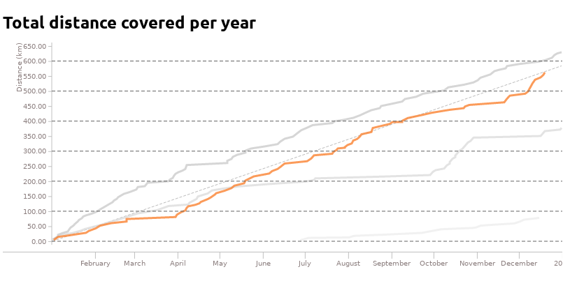

I have been running since June 2016, and each year I set a goal for the total
distance I want to cover over the year. In 2017, I aimed for 365 kilometres,
and in 2018 I aimed for 588 kilometres (which is 365 miles). For 2019, I kept
the bar at 588 kilometres, and focused on increasing my pace.

I use Strava to track my runs, and it does a great job at this. I want to track
my progress over the year and compare it to the previous years, but this isn't
possible inside Strava.

I want to build and release a website that lets you connect your Strava account
and visualize your running data.

### Project Goals

- A website that visualizes running progress.
- Connect your account via Strava API.
- Display the total distance run each year.
- Display the number of runs per week.
- Display average pace over time.

### Roadmap

This is my rough plan for how I want to tackle this project:

1. Get it working locally for me with hardcoded credentials.
2. Support other peoples accounts.
3. Launch at https://dash.stayradiated.com.

### Getting the data

Fortunately, Strava make this really easy - they have a [fantastic
API](https://developers.strava.com/docs/reference/) I can use to extract my
data. I [signed up for API access](https://www.strava.com/settings/api) and
created a basic Node.js app to authenticate via OAuth to get my access token.

It didn't take long to get a JSON dump of all my activities. I used the
[`RESTful-stream.ts`](https://github.com/neuroforgede/RESTful-stream.ts)
library to create an async iterator - this is a nice way to paginate over all
the available activities.

```javascript
const PER_PAGE = 100

const getActivities = async (accessToken, page) => {
  const response = await got(
    'https://www.strava.com/api/v3/athlete/activities',
    {
      searchParams: {
        access_token: accessToken,
        per_page: PER_PAGE,
        page
      },
      responseType: 'json'
    }
  )

  return {
    page
    body: response.body,
  }
}

const getAllActivities = (accessToken) => {
  const ctrl = {
    hasNext(item) { return item.body.length === PER_PAGE },
    next(item) { return getActivities(accessToken, item.page + 1) },
    parse(item) { return item.body }
  };

  return iterate(parse(ctrl, getActivities(accessToken, 1)))
}

for await (const activity of getAllActivities(accessToken)) {
  // iterate over each activity
  console.log( JSON.stringify(activity) )
}
```

### Visualizing the data

The hard part is figuring out how to visualize the data. I'm a big fan of
[Grafana](https://github.com/grafana/grafana), they make it easy to display
time series data, along with controls for zooming in and out. However, I
couldn't find out how to use their graphing library independent of the rest of
the project, so I need to find an alternative.

[D3](https://d3js.org/) is a fantastic library, and has been around for ages,
however it is quite low level and isn't the easiest to work with. I found some
libraries that abstract the complexity, such as
[Rickshaw](https://tech.shutterstock.com/rickshaw/) and
[NVD3](http://nvd3.org/), but they don't quite cover what I am looking for.

I stumbled across [React Timeseries
Charts](http://software.es.net/react-timeseries-charts/).  This library uses d3
under the hood, but exposes a clean React interface to build a chart.  The
creator, [ESNet](https://github.com/esnet/), also wrote a library for working
with time series data, called [Pond.js](https://esnet-pondjs.appspot.com/).
These libraries are quite well documented, and have plenty of examples I can
learn from &mdash; however, it is still a struggle to get it working just right.

Right now, I currently have a chart displaying my running distance for each
year. The code is a mess, but I'm happy that it's working. Next step is to
refactor the code, add a legend, and have an option to select which years to
show.


