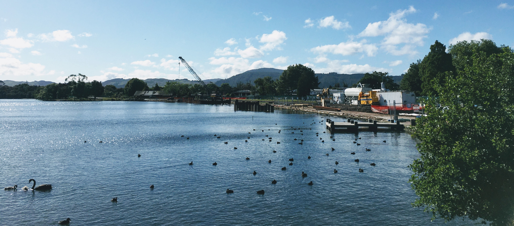

## Thoughts

- It's been a week of being back home in Rotorua. I've been away since
  February, but it feels like I haven't missed a day.
- I woke up this morning from a dream that I had just found out that Tom
  Rosenthal ([the musician](http://tomrosenthal.co.uk/), not [the
  actor](https://www.tomrosenthal.net/)) was in Rotorua on holiday. I decided
  that if he was, I should ask if he would like to come over for a cup of
  tea. Unfortunately it turns out he isn't in New Zealand. Oh well.
- I want to set up my Snapchat account to automatically post my story to this
  blog, I'm currently figuring out how to do that...
- I'm starting to enjoy dumplings. For most of my life I didn't get what the
  fuss was about, but now I get excited for them, and I don't know why. They
  are little parcels of delicious joy. 🥟
- On Sunday, I tried to repair my Canon 550D. It's got a broken shutter, so I
  followed some tutorials to pull the whole thing apart and have a look. I
  managed to put it back together (twice!), but the camera still doesn't work...

## Links

- After searching to see if Tom was in New Zealand, I came across [Will
  Darbyshire's](https://www.youtube.com/channel/UCeD3VwVu0HzIkPbLwl1D_VA)
  marvellous YouTube channel. He's got this great style of cutting together
  beautiful shots, something I've been interested in trying myself. He also has
  a great taste in music.
- I've been using [LanguageTool](https://www.languagetool.org/) for
  spell-checking these blog posts. They have an offline tool you can download,
  and [this amazing person](https://rhysd.github.io) made a neat Vim plugin
  called [vim-grammarous](https://github.com/rhysd/vim-grammarous). After
  reading ["Learn Vimscript the Hard
  Way"](http://learnvimscriptthehardway.stevelosh.com/) I have great
  respect for anyone who publishes vim plugins, it's still on my todo list.
- The [Casper Glow Light](https://casper.com/glow-light/) looks amazing, and I
  love all the design elements, especially the way you can rotate it to change
  the brightness.  There is a great article by [Bolt, who tear it
  apart](https://blog.bolt.io/casper-glow/) and show off how it's built.

## Music

- [Tom Rosenthal - Big Pot of
  Hummus](https://www.youtube.com/watch?v=eOpCMbNegW0). Every time I eat hummus
  I start singing this song. It's the perfect mix of emotions and food.
  > I got a big pot of hummus and it's going good 
  > Somewhere in the middle between glory and doom 
  > And there's someone that I'm lovin’ but they’re not in this room 
  > But nothing's gonna break my day!
- [Tigers in the Sky - Cool](https://www.youtube.com/watch?v=654z-OU134o).
  This song perfectly captures a lazy summer day, and I love it.
  > What's my mornin' 
  > Without a little yawn? 
  > Just sitting on my lawn 
  > Watching the day roll by
- [slenderbodies - anemone](https://www.youtube.com/watch?v=fXgczro95lk). I
  have no idea what they are singing, but every time I hear this song I can't
  stop from flailing my arms around.

## Books

What I've been reading this week.

- [The Defenders by Philip K. Dick](https://en.wikipedia.org/wiki/The_Defenders_(short_story))
- [Colonly Defenders by Philip K. Dick](https://en.wikipedia.org/wiki/Colony_(short_story))
> The ultimate in paranoia is not when everyone is against you but when
> everything is against you. Instead of "My boss is plotting against me," it
> would be "My boss's phone is plotting against me."
- [Norse Mythology by Neil
  Gaiman](https://en.wikipedia.org/wiki/Norse_Mythology_(Neil_Gaiman)). I've
  actually been listening to the audio book which is pretty good. I'm a big fan
  of Norse mythology (I spent many hours of my childhood playing [Age of
  Mythology](https://en.wikipedia.org/wiki/Age_of_Mythology)) but I hadn't
  heard many of the myths in this book. 
- [Good Omens by Terry Pratchett & Neil
  Gaiman](https://en.wikipedia.org/wiki/Good_Omens). I picked this up at second
  hand book sale on Saturday. I've just started, and I can tell it's going to
  be a favourite. After I post this I'm going to grab a cup of tea and continue
  reading it.

## Places

- [Grøunded](https://www.facebook.com/Grounded.Rotorua/) . There is a new cafe
  that has popped up nearby, I had an enjoyable morning here sketching app
  ideas and gazing out the window. I think I will return here next Sunday.

`video({ src = './grounded.mp4' })`

Inspired by Will Darbyshire I tried recording some short videos and stitching
them together.
