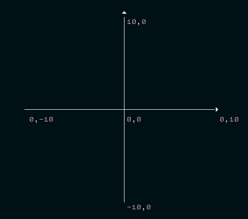
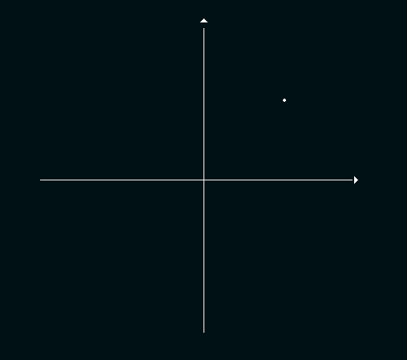
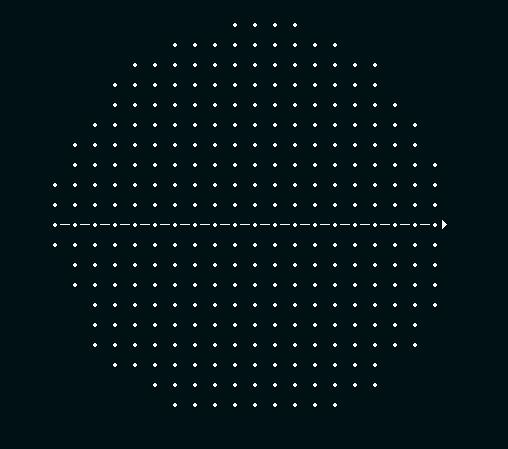

This is my solution to [dailycodingproblem.com](https://www.dailycodingproblem.com) problem #14.

## The Problem

> The area of a circle is defined as πr^2. Estimate π to 3 decimal places using a
> Monte Carlo method.
> 
> Hint: The basic equation of a circle is x2 + y2 = r2.

## My Solution

For this challenge I am going to be using the
[`cli-graph`](https://npmjs.com/package/cli-graph) library to draw to the
console.

Let's imagine a circle with a radius of 10. Because we don't know what Pi is,
we can't draw a circle yet... but we can create a square graph to hold the
circle.

```typescript
const Graph = require('cli-graph')

const RADIUS = 10

const graph = new Graph({
	height: RADIUS * 2,
	width: RADIUS * 2,
})

console.log(graph.toString())
```




### Plotting a point

The way we are going to estimate Pi, is by plotting millions of random points
on the graph, and finding the ones that are inside our circle. We can use the
ratio of points inside the circle to those outside as a rough estimate of the
area of the circle.

Let's start with plotting a single point:

```typescript
graph.addPoint(5, 5)
```



### Calculating the radius

Now we have a point on the graph, we need to che check if that point is inside
our imaginary circle.

To do this, we can use equation of a circle supplied to find the radius of a
circle that contains a particular point on it's circumference.

If that radius is less or equal to our `RADIUS`, than we know that point is
inside our circle!

#### Equation of a Circle:

```typescript
Math.pow(x, 2) + Math.pow(y, 2) === Math.pow(radius, 2)
```

Let's twist it around to get the radius:

```typescript
radius === Math.sqrt(Math.pow(x, 2) + Math.pow(y, 2))
```

Using these equations we can create a function to calculate the radius of a
given point on the graph.

```typescript
const calculateRadius = (x, y) => Math.sqrt(Math.pow(x, 2) + Math.pow(y, 2))

calculateRadius(5, 5)
// 7.071...
```

And use that function to check if a point is within a given circles radius.

```typescript
const isPointInCircle = (x, y, r) => calculateRadius(x, y) <= r

isPointInCircle(5, 5, RADIUS)
// true, 5,5 is within our circle

isPointInCircle(10, 10, RADIUS)
// false, 10,10 is not within our circle
```

## Let's get a random point

We are also will return a number between -RADIUS and RADIUS

```typescript
const getRandomPoint = (r) => Math.random() * (r * 2) - r
```

We can now pick a random coordinate on our graph, and check if it is inside
a circle:

```typescript
isPointInCircle(
  getRandomPoint(RADIUS),
  getRandomPoint(RADIUS),
  RADIUS
)
```

Now we can try a bunch of random points within our square, and plot if they are
inside or outside our circle.

```typescript
for (let i = 0; i < 10000; i++) {
	const x = getRandomPoint(RADIUS)
	const y = getRandomPoint(RADIUS)

  const char = isPointInCircle(x, y, RADIUS)
    ? '•'
    : ' '

	graph.addPoint(x, y, char)
}

console.log(graph.toString())
```



We can see our circle!
While it isn't a _perfect_ circle, we can still use it to approximate Pi.

The area of a circle is defined as <code>πr<sup>2</sup></code>.

```typescript
area === Math.PI * Math.pow(r, 2)
```

We can twist this around:

```typescript
Math.PI === area / Math.pow(r, 2)
```

But how do we get the area of our circle?
What we can do, is find the rough percentage of space that our circle
occupies in the square

```typescript
const count = 10_000_000 // ten million is usually good enough for 3 decimal places

let hits = 0

for (let i = 0; i < count; i++) {
  const x = getRandomPoint(RADIUS)
  const y = getRandomPoint(RADIUS)
  if (isPointInCircle(x, y, RADIUS)) {
    hits += 1
  }
}

const approximateCircleRatio = hits / count
// ~78.54%
```

We can also calculate the area of our graph:

```typescript
const areaOfGraph = (RADIUS * 2) * (RADIUS * 2)

console.log(areaOfGraph)
// > 400
```

By combining the `approximateCircleRatio` and the `areaOfGraph` we can find the
approximate area of a circle.

```typescript
const approximateAreaOfCircle = approximateCircleRatio * areaOfGraph
```

And now we can use the area of a circle to to approximate Pi!

```typescript
const approximatePi = approximateAreaOfCircle / Math.pow(RADIUS, 2)

console.log(`Approximate PI: ${approximatePi.toFixed(3)}`)
// Approximate PI: 3.142
```

The more points we plot on the graph, the more accurate our estimate will be,
but it will also take more time.
