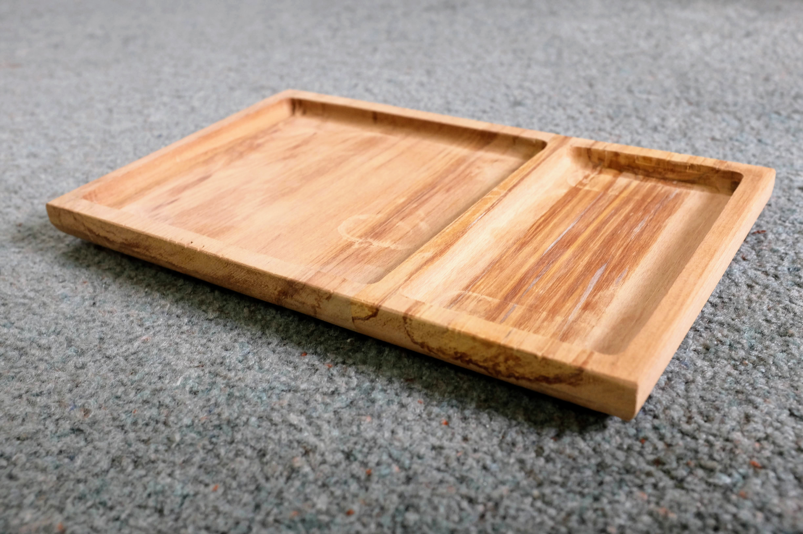

- I spent a lot of time this week configuring my microservices to deploy to
  Cloud Run using Cloud Build has a been a mission - but after serveral days I
  think I have it working. I plan to write up a full post about the setup.

- I bought a mountain bike. I was thinking about getting a fixie, because they
  look fun - but they are not very practical if you want to go up and down hills.
  The bike I bought was a cheap one I found on Trade Me. I'm quite pleased with
  it.

- I published two short videos on YouTube: **[A Walk By the
  River](https://www.youtube.com/watch?v=CDnxtsyUV3o)** and **[French
  Toast](https://www.youtube.com/watch?v=XAMxu0bNs7k)**. I am quite enjoying
  the filming and editing process, and hope to keep making more videos in the
  future.

- It's been a long time since I last did any woodworking, but I got back into
  it this woodworking. I was browsing the Every Day Carry subreddit, looking
  for gift ideas - and came across a DIY wooden tray someone had made for
  holding their gear. I thought I would have a crack at making something
  similar. The result turned out pretty well. I filmed the whole process and
  plan to write up a post about what I learned building it.

## Links

- **[Grim Grains](https://grimgrains.com/site/home.html)** I love the art style
  of this site, and love picking on random ingredients and reading about them.
  There are also a bunch of recipes I want to try out from here.

- **[N Interesting Things](https://ninterestingthings.com)** Steve Mould has
  one of my favourite YouTube channels, and his series of random Interesting
  things is fantastic.

## Recipes

- **[Fresh Tomato Gazpacho](https://foodwishes.blogspot.com/2011/09/fresh-tomato-gazpacho-crumbled-stale.html)**
  This is a fantastic meal for a hot summer night. I had never tried gazpacho
  before, but I am now a massive fan. As Chef John says, it's _"Like a salad on
  a spoon"_ so it must be healthly - but it also has an incredible flavour. It
  was a big hit with the family as well.

