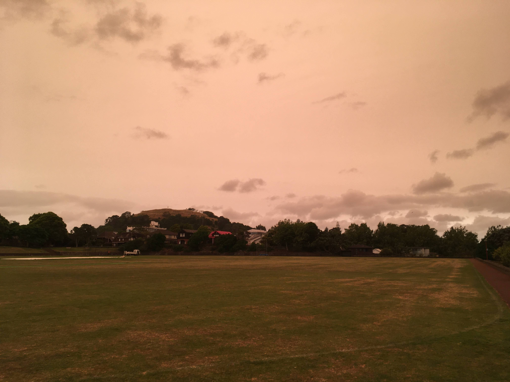

- Woo! It's the first week of 2020! This is a slightly shorter week than usual,
  because it starts on a Wednesday - shout out to
  [Odin](https://en.wikipedia.org/wiki/Wednesday#Etymology)!

- I spent New Years with my friends on a mountain in Auckland. We sat at the
  summit of Big King watching the Sky Tower fireworks and enjoying a shot of
  whiskey.

- The Australian bushfires are absolutely mental. The amount of damage it has
  down is unreal. On Sunday, as I sit in Auckland writing this, the afternoon
  sky is a dark hazy orange. This is from all the smoke! The orange light gives
  everything a spooky feeling. [Donate to the Aussie Rural Fire
  Service](https://www.rfs.nsw.gov.au/volunteer/support-your-local-brigade).

- This week I have continued to experiment with recording and editing short
  films - mostly of my friends and our new years celebrations. I have been using
  Olive Editor, which is my new favourite video editor for Linux. My videos are
  all on YouTube, but not all are public (because friends privacy, etc). My
  latest video, I tried filming in portrait to create a short vertical video,
  which plays great on mobile phones.

- I want to keep recording and editing videos this year. In 2017, I did
  Polaroid photos, and in 2018/2019 I switched to digital photos. I'm feeling
  that 2020 is my year to focus on video. I also want to get better at
  recording audio, especially of myself speaking, so I can narrate a story over
  a video.

- I have some ideas about starting a routine, which includes going for a morning
  run, practising German, practising the guitar, practising card magic and
  spending time on app development. I still need to figure out how much time to
  prioritise each thing, and what time of day works best for each.

- My friend, [Edin](https://edinz.com), has published a book! It's called ["The
  Brilliance of Birds"](https://www.penguin.co.nz/books/the-brilliance-of-birds-9780143772156) and it is
  full of stunning photos and interesting info about NZ birds.

- This year I want to switch to an environmentally friendly diet. I am not sure
  that is exactly, but it will mean minimising the amount of food I eat that is
  harming our environment. Right now, that means cutting out all meat.
