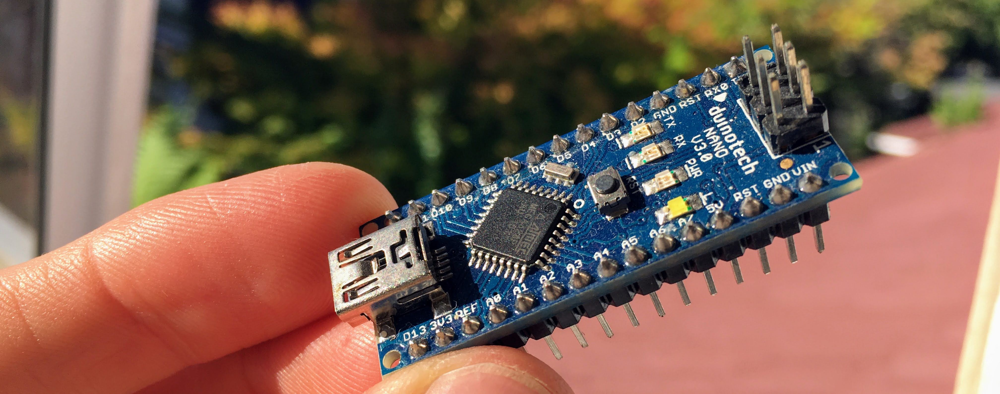

A wee while ago, I picked up [a clone of an Arduino
Nano](https://www.jaycar.com.au/duinotech-nano-board-arduino-compatible/p/XC4414)
from the local electronics store.

This afternoon, I was trying to figure out how to run code on it from a linux
computer without using the Arduino IDE. It wasn't as easy as I thought it would
be, so I thought I'd write down what I learned.

## Instructions

First up, connect the arduino to your computer with a USB cable.

The arduino should appear under `/dev`. You can find the device name by listing
the most recently connected USB tty. In my case it is `/dev/ttyUSB3`.

```shell
$ ls -lt /dev/ttyUSB* | head -n 1
crw-rw---- 1 root uucp 188, 3 Mar 15 16:47 /dev/ttyUSB3
```

You will also need to [install the Arduino
CLI](https://arduino.github.io/arduino-cli/installation/).

Once that is done, run these commands to install the Arduino AVR libraries.

```shell
$ arduino-cli core update-index
$ arduino-cli core install arduino:avr
```

Cool, now we can create a simple test program. All it will do is blink the
on-board LED on and off.

```shell
$ arduino-cli sketch new blink
```

That command will create a folder in the current directory, called `blink`, and
an empty file inside called `blink.ino`.

Replace the contents of `blink/blink.ino` with the following:

```c
void setup() {
  pinMode(LED_BUILTIN, OUTPUT);
}

void loop() {
  digitalWrite(LED_BUILTIN, HIGH);
  delay(1000);
  digitalWrite(LED_BUILTIN, LOW);
  delay(1000)
}
```

Now we can compile the code. Make sure to run this commands in the parent
directory, and NOT within the `blink` directory.

```
$ arduino-cli compile --fqbn arduino:avr:nano blink
```

The final step is to send the compiled code to the arduino. The trick here is
to know the FQBN.  When I tried using just `arduino:avr:nano` it would not
work.  For my arduino nano clone, I had to add `cpu=atmega328old`, so that it
uses the old bootloader.

```
$ arduino-cli upload --port /dev/ttyUSB3 --fqbn arduino:avr:nano:cpu=atmega328old blink
```

And done! The arduino LED should now be blinking on and off every second!
