import App from './meter'
import Label from './label'

<App />

## Table of Contents

- [Summary](#summary)
- [The Problem](#the-problem)
- [How Do You Read A Meter?](#how-do-you-read-a-meter)
- [A Simple Circuit](#a-simple-circuit)
- [Software: The Odometer Project](#software-the-odometer-project)
- [How Accurate Is It?](#how-accurate-is-it)
- [What's Next?](#whats-next)

## Summary

[Odometer](https://github.com/stayradiated/pi-odometer) is a small project I
have been working on for the past couple of weeks. It tracks how much natural
gas we are using at home, helping us reduce our gas usage.

## The Problem

The hot water at our house is heated using an instant gas water heater. When we
turn on the hot water tap, the gas burner automatically fires up to heat the
water. This is pretty great (unlimited hot water!), but it means that the more
hot water we use, the more gas we use, and the higher the bill at the end of
the month. Our bill for January 2020 was a lot higher than we expected
(especially for summer!), so we need to cut down on how much gas we are using.

We are going to try to have shorter showers, and not use hot water if cold
water will suffice, though there is no easy way to enforce this. We also cannot
tell how much of a difference an extra minute or two in the shower is making.
Our gas bill will arrive at the end of each month and only then can we see how
we much gas we used. I think a monthly cycle is far too long to get feedback -
it would be much more helpful to know how much gas we used at the end of each
day.

I realised that is a way to get this information - from the gas meter sitting
outside our house. I decided to begin each morning by taking a reading from the
meter and entering into a spreadsheet. With this, I could see how much gas we
were using each day.

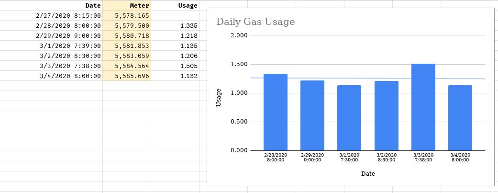

Having to read the gas meter every morning isn't ideal. I try to get to the
meter before any hot water is used for the day, but sometimes I'm too late, and
the numbers are skewed slightly. I also can't tell when the gas is used
throughout the day - are we using more gas in the mornings or evenings?

To get higher fidelity information, we need a way of automatically tracking our
gas usage. This would be fantastic, then we could see how much gas we are using
at any moment throughout the day. The problem is, how do we get that
information from our gas meter? If our gas meter had an API, this would be a
piece of cake, but what do you do if your meter is old school?

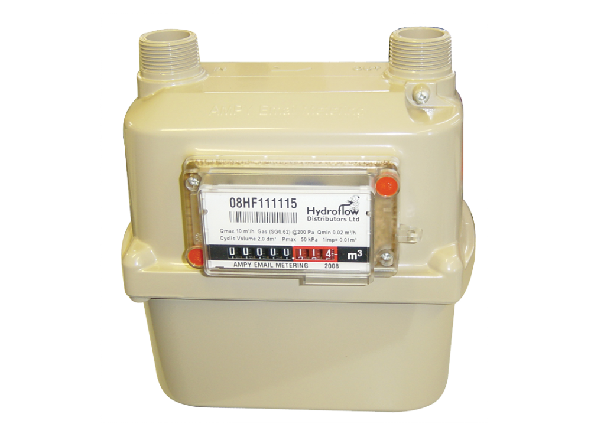

## How Do You Read A Meter?

I was originally thinking I would need to set up a small camera in front of the
meter and use some [clever OCR software](https://tesseract.projectnaptha.com/)
to read the digits. This wouldn't be easy: I would need to find a way to
protect the camera from the outdoor weather, and also make sure that it could
read digits that were only partially visible.

I was wondering how existing smart energy monitors read gas meters. I found one
such product, called the [Smappee](https://www.smappee.com/us/gas-water). This
device requires you to attach a small sensor to your gas meter so it can detect
when the meter does something.

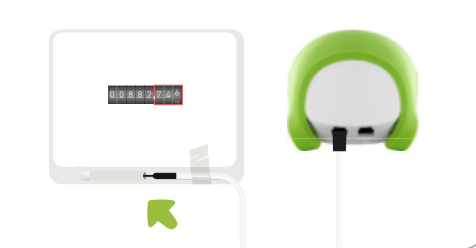

Helpfully, on the Smappee website, they document [the different types of meters
that can be monitored](https://www.smappee.com/us/gas-and-water-compatibility).
From this, I learned that some meters have a small reflective surface on the
last digit (typically the 0). By using an infra-red LED and an optical sensor,
you can detect when the barrel spins around.

Unfortunately, our meter doesn't have this reflective surface. The good news
is, that there is another common way to reads gas meters. Inside some meters,,
there is a small rotating magnet. As gas is used, and the numbers increment,
this magnet is spun around, moving its magnetic field with it.

Magnets are awesome, and there are two electronic components you can use to
detect a magnetic field:

- [a Hall effect sensor](https://en.wikipedia.org/wiki/Hall_effect_sensor)
- [a Reed switch](https://en.wikipedia.org/wiki/Reed_switch)

I happened to already have a spare reed switch, so I used that.

The next time someone had a shower, I rushed outside with the reed switch and a
multimeter. I waved the reed switch around the case of the gas meter, hoping to
find where the magnet was. Success! I found it right next to the "fastest"
digit of the meter. Every time the dial reached `9`, the switch would close,
and when the dial passed `0`, the switch would open again. For our gas meter,
this means every activation of the switch equates to 0.01m³ units of gas being
used.

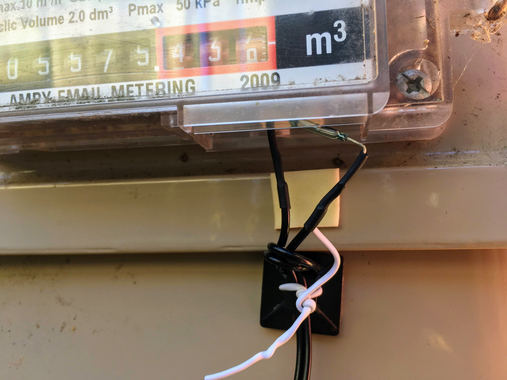

Getting the switch to stay in position was not easy. I didn't want to tamper
with our meter in any way, so I used double-sided tape and twist ties to attach
the switch. In the photo, you can see the reed switch is sitting at an odd
angle. While it will still work from this position, it's not ideal. I have
since positioned it so that it is as close as possible to the magnet and
parallel with the case.

---

If you are interested in more details about how to monitor your gas meter,
[Open Energy Monitor](https://openenergymonitor.org/) has [a guide for
monitoring your gas
meter](https://github.com/openenergymonitor/learn/blob/master/view/electricity-monitoring/pulse-counting/gas-meter-monitoring.md#magnetic-counting).
I wish had found this before I started this project!

## A Simple Circuit

So, I've got the reed switch set up. Now it's time to connect it to a computer
so we detect when the switch is open or closed. 

For this project, I am using an old [Raspberry Pi
B+](https://en.wikipedia.org/wiki/Raspberry_Pi). I think the Pi is a good
choice, because it doesn't use much power usage (around 1 W), has plenty of
GPIO pins, and supports wifi with the help of a little USB adapter.

Because the Pi is not weatherproof, I cannot place it outside directly next to
the gas meter. Instead, it is going to sit safely inside our house. The reed
switch is sealed inside a glass tube, and also sits beneath the meter, so it
_should_ be fine.

To connect the Pi to the switch, I used a very long [RCA
cable](https://en.wikipedia.org/wiki/RCA_connector) running out the window. I
soldered RCA connectors to the switch and a bit of Veroboard with the
resistors. Having the RCA connectors has proven very convenient because if I
need to debug the circuit, I don't need to have the long cable connected -
instead, the switch can connect directly to the board.

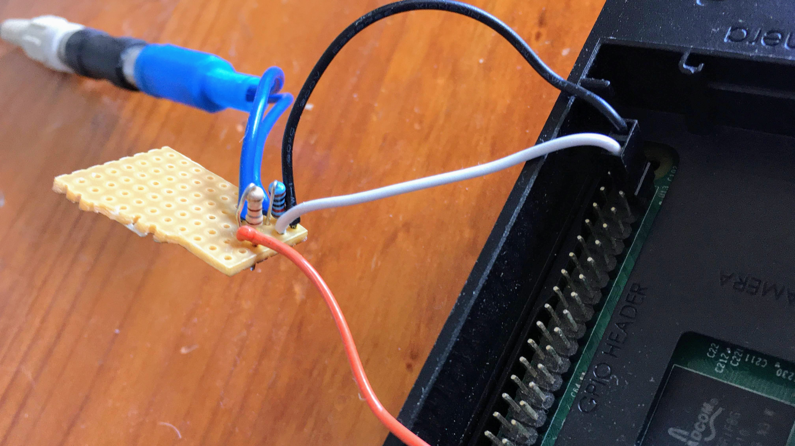

This is a schematic of the circuit I ended up with:

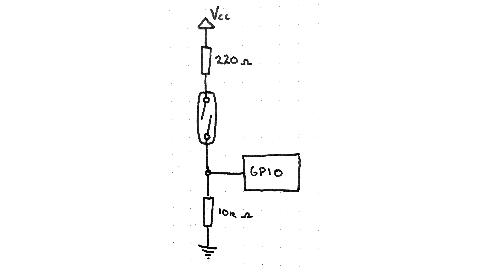

It's crucial to have [a pull-down
resistor](https://grantwinney.com/using-pullup-and-pulldown-resistors-on-the-raspberry-pi/#fixing-the-simple-circuit),
otherwise, the GPIO pin will sometimes be in a "floating" state and the Pi won't
be able to accurately detect if the switch is open or closed.

The reed switch connects the [3.3v power
source](https://pinout.xyz/pinout/pin1_3v3_power#) from the Pi to [GPIO Pin
26](https://pinout.xyz/pinout/pin37_gpio26). When the magnet passes near the
switch, the pin detects a rise in voltage. When the magnet passes away, the
voltage drops back to 0.


## Software: The Odometer Project

I have written a tiny program in Go. It's called **Odometer** because you could
use it to monitor any sort of odometer, not just gas meters. You can find
the source code and installation instructions over at
[stayradiated/pi-odometer](https://github.com/stayradiated/pi-odometer).

The software is deployed to the Raspberry Pi using
[Balena](https://www.balena.io/). I am a big fan of Balena, their platform
makes it fun to deploy a docker image to a Pi. It also means I don't have to
worry about configuring Linux - their OS automatically connect to wifi,
automatically updates, and will restart my service in case of a crash or power
loss. I also never need to manually SSH in, as all logs are available through
their online dashboard.

Odometer listens to GPIO Pin 26 and simply counts the number of times the
voltage rises and then falls. It serves up the total count over a simple HTTP
API.

```bash
$ curl "http://192.168.0.14/metrics"
# HELP gas_usage Units of gas used.
# TYPE gas_usage gauge
gas_usage 661
```

The API response is designed to be parsed by
[Prometheus](https://prometheus.io/). Prometheus is one of the most powerful
tools I've seen for monitoring pretty much anything. It is also quite simple to
get it to start polling your system and collecting data. While I am still
learning how to use their query language, I have found it to be very powerful.
There is a bunch of great documentation and support for the most popular
programming languages.

My Prometheus server is configured to poll the Pi every few seconds and store
the value for `gas_usage` in its database. I can then query Prometheus to see
how gas usage changes over time.

The simplest query, just `gas_usage`, displays the value of the counter over
time.

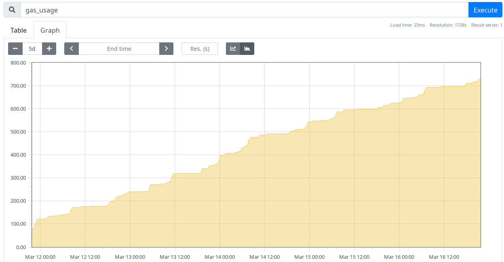

Instead of just graphing the counter increasing, I can also query for the rate
of change of the counter over a given time interval, for example,
`increase(gas_usage[24h])`.

I am also using [Grafana](https://grafana.com/) to build a live dashboard.
Grafana is amazing for creating a beautiful graph visualizations and supports
Prometheus out of the box. It's got an intuitive UI, one of the best time range
selectors I've seen, and it is very easy to put together a dashboard in
minutes.

I've been constantly iterating the Grafana dashboard, trying out different
designs and queries. Currently, it displays our usage over the past week, with
graphs displaying our usage by day, hour and quarter-hour periods.

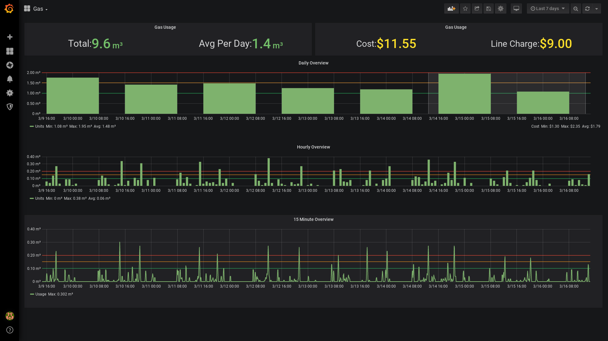

## How Accurate Is It?

I wanted to check that my software was accurately reading the amount of gas
being used. Every hour or so, I would go to the gas meter and take a reading. I
would then compare this with what my software was recording. Using a
spreadsheet, I could see how these numbers tracked over time.

This is the legend for the graphs:

- <Label backgroundColor="#3366cc">Blue</Label> reading from the gas meter
- <Label backgroundColor="#dc3912">Red</Label> reading from my software

As you can see in the following graph, the red line is far below the blue line.
For some reason, my system was miscounting the gas usage by about 1/2 of what
it should be.

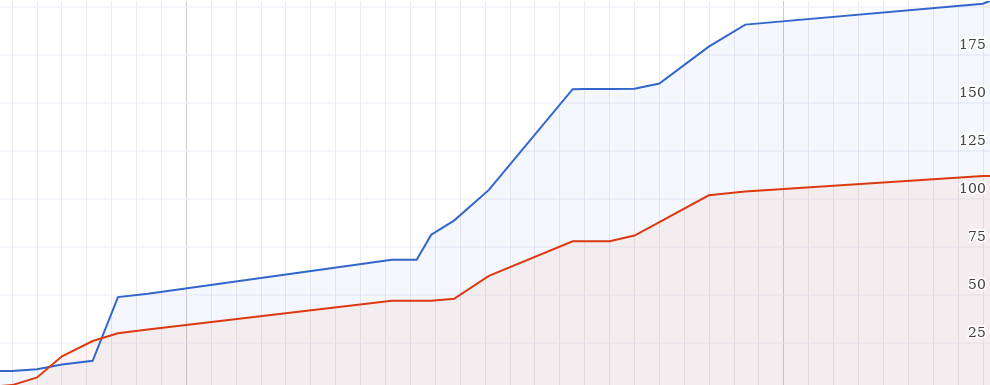

I soon realised that this was because my initial circuit did not include a
pull-down resistor. I originally thought I didn't need one, because when
testing the system, it detected the switch activating. However, because the pin
is not switching between 3.3v and 0, but instead 3.3v and some _floating_
voltage, it wouldn't perfectly detect every single switch activation.

After adding a pull-down resistor, the software no longer missed any
revolutions. However, it became clear it  was also picking up quite a few extra
ones. Things would begin fine, but soon the red line would climb high above the
blue.

I think this might happen when the magnet is not quite fully in or out, causing
the reed switch connection to not be completely open or closed, and flutter for
a brief millisecond.

You can also see in this graph when I deployed a new version of the software,
as the counter would reset to 0.

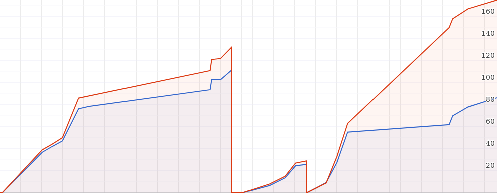

I needed to filter out certain events from the switch, but how to know which
rise and falls were legit?

I discovered that even when a lot of hot water is being used, and the meter
ticks up a fast pace, it still takes a few seconds to use 0.01m³ of gas, and
for the magnet to activate the switch. This means we can ignore a voltage
change from low to high that happened in less than 500ms.

For example, if we look at these rises (`+++`) and falls (`---`):

```
00:00:01.000 +++ # legit
00:00:02.000 --- # legit, increment counter
00:00:02.003 +++ # ignore this event, it happened too soon
00:00:02.007 --- # ignore this event, it happened too soon
00:00:05.000 +++ # legit
00:00:05.501 --- # legit, increment counter
```

By requiring a minimum time between the rise and fall, I reduced the error rate
to around 1%.  I continued monitoring the gas usage over a couple of days, and you
can see how closely the red line follows the blue:

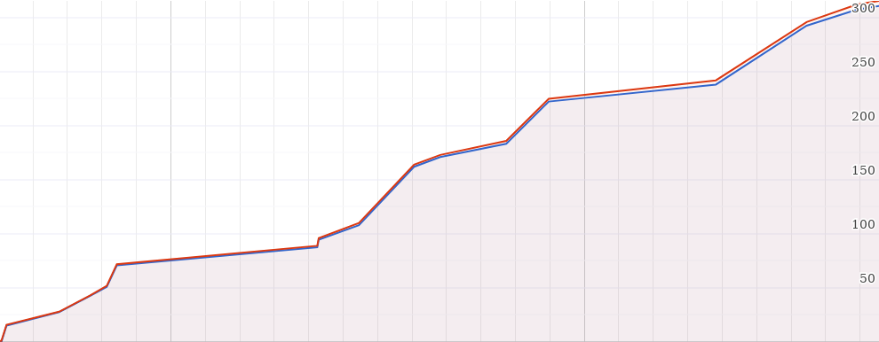

It's not perfect, but it's good enough for me. If I wanted to get an even more
accurate reading, I could add a second reed switch next to the first, and
require that they both agree before incrementing the counter. Shout out to my
buddy [Pete](https://github.com/peterheesterman) for this idea!.

## What's Next?

I have been thinking about setting up a live counter of our daily gas usage,
somewhere in the house where everyone can see it. This would give us a regular
reminder on how much gas we have used that day, and hopefully cause us to use
less gas.

We also recently installed a temperature controller for our water heater.
Previously our water was heated to a fixed temperature of 55⁰c. With the
controller we can set the water temperature to as low as 37⁰c, further reducing
our gas usage.

The temperature controller also has a button to turn the heater on and off.
I've been thinking about how we could wire in a timer so that showers could
have a strict time limit before they suddenly get quite cold...

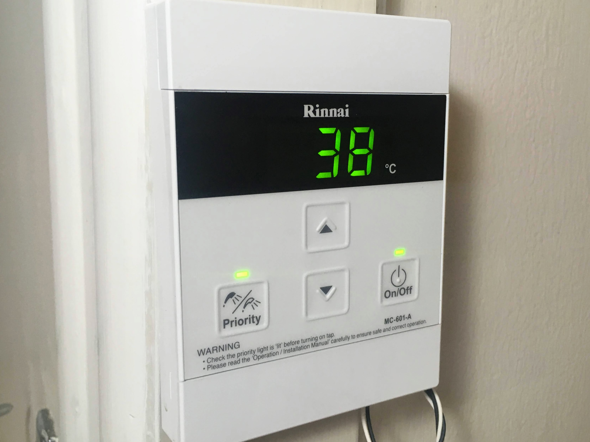
