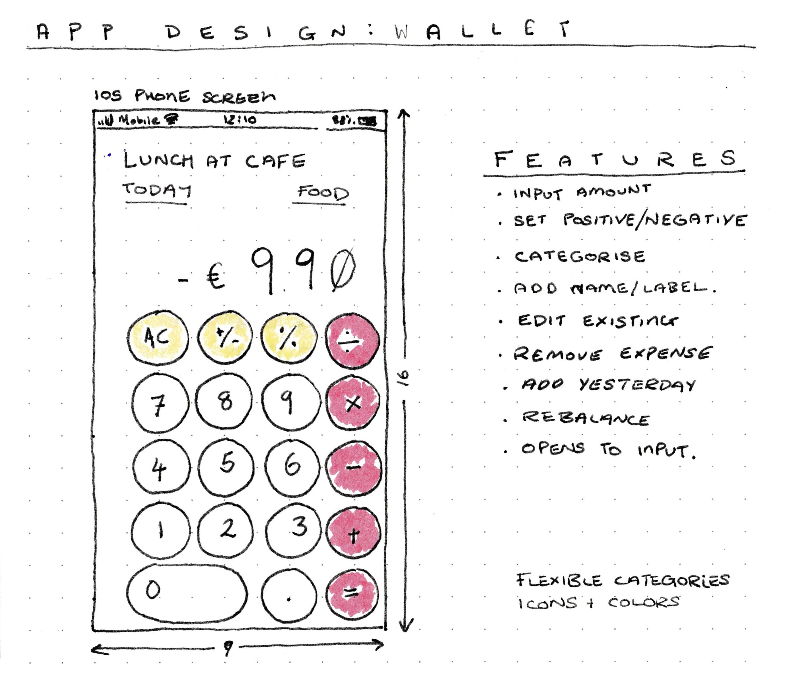
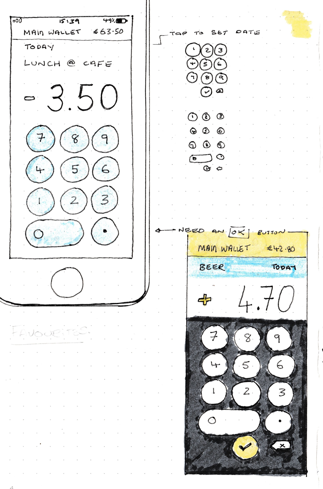
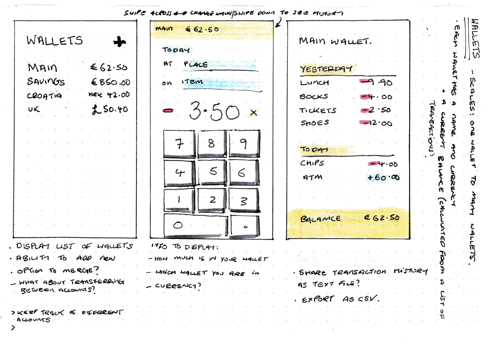
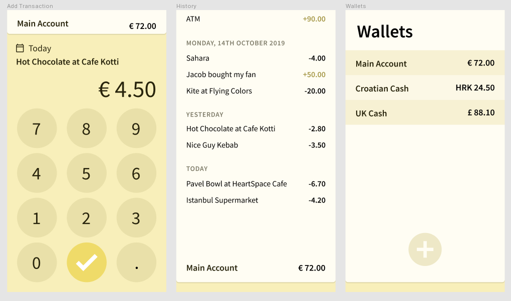

Way back in October 2019, I wanted to build a simple app to help track cash
payments. This week I finally started developing the app. It's still in it's
infancy, but I wanted to share what I had so far.

## Notebook Sketches

I have a few rough sketches. I want the app to be minimal and efficient. Upon
hitting the app icon, it should immediately open to the "calculator input"
screen, where you can enter the amount paid, and maybe a short description.

---

The big round buttons are inspired from the iOS calculator app. I think the key
pad should have `7`-`8`-`9` at the top, similar to calculators and cash
registers, instead of `1`-`2`-`3` at the top like telephones.

---

The app also needs to display a list of recent transactions, and display how
much money you have left in your wallet. I'm also thinking about supporting
multiple currencies, an

## Design Prototype

I've been using [Figma](https://figma.com) to prototype a design for the app.
I've been struggling with colours, and at one point even tried designing it in grayscale.

## React Native Development

This week I finally made a start with React Native & Expo to build the input
screen. I'm quite proud of it, especially the placeholder digit system, with
the `.00` and the automatically inserted commas.

`video({ src = './wallet_demo.mp4', width = 292, height = 500 })`

## What's next?

- Implement a way to store transactions in the app.
- Build the transaction history page.
- I also need to pay Apple for a developer license so I can install the app on
  my phone and use it.
