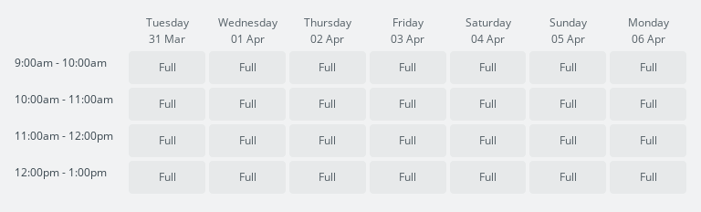

Last Thursday, New Zealand entered [Alert Level
4](https://covid19.govt.nz/government-actions/covid-19-alert-level/), and we've
been asked to stay home as much as possible. To avoid shopping in person at the
supermarkets, my family has been ordering our groceries online and then picking
them up at the store.

However, we are not the only ones shopping online. Quite often there are no
time slots available for collecting the groceries - they have already been
booked out! 



Looking at a whole week of booked out times, you might believe that you
never had a chance of using click & collect. However, what the Supermarkets
don't make clear is that they regularly open up new slots, particularly around
midnight.

I was interested in monitoring the available timeslots, to find out how quickly
they booked out, and at what time of the day new ones were released.  Over the
past few days, I have built a website to track the available click & collect
slots for supermarkets across NZ. It's called
[clickandcollect.nz](https://clickandcollect.nz) and it's ready to use now!

[](https://clickandcollect.nz)

## Features

The site is fairly simple. It displays a list of NZ supermarkets that support
click & collect - including Countdown, PAK'nSAVE, New World and FreshChoice.

### Search

You can quickly find a particular supermarket by using the search input. It's
lightning-quick and will match against both the supermarket name and address.

`video({ title = 'Searching', src = './supermarket_search.mp4' })`

### Calendar

Upon selecting a supermarket, a calendar of the next 2 weeks is displayed. The
number of available slots is displayed for each day. Most supermarkets allow
click & collect to book up to a week in advance, with the closest days
usually booked out.

A timeline is displayed below the calendar, tracking the total number of
available slots over time. This is the most useful feature of the site and
clearly shows what time of day new slots are added, and how quickly they book
up.

`video({ title = 'Viewing store availability', src = './supermarket_select.mp4' })`

### Timeline Scrubbing

The timeline is interactive! As you move your mouse across the chart, the
calendar automatically updates to show which slots were available at that time.

This is useful to show which new slots are made available, and which slots book
out the fastest.

`video({ title = 'Scrubbing through timeline', src = './supermarket_scrubbing.mp4' })`

## Behind the scenes

This website has been a fun project to work on. It's a static website, which
means that's just a few HTML files that are hosted on a plain old webserver.
It doesn't cost me anything to host it (thanks
[Netlify](https://netlify.com/)!) and means the site can handle a large amount
of traffic without issues.

The front-end is built using [Next.js](https://nextjs.org/), which is a
fantastic tool.  Next.js makes building websites using React a dream. It
handles a bunch of stuff for you, including URL routing, typescript support and
compiling everything into static files. Their documentation is legendary and
had an answer for all my questions.

The front-end gets its data from an API. This isn't an ordinary API - it's
actually [just a bunch of JSON files](https://api.clickandcollect.nz), which
are also hosted on the webserver.  These JSON files are regularly updated,
which keeps the data on the site fresh.

[](https://github.com/stayradiated/clickandcollect.nz.api)

The JSON files are created by a separate program. This is a small program I
have built. Every 5 - 7 minutes, it visits all the supermarket websites and
counts the number the available slots. The result is stored in an SQLite
database. A separate program then reads the latest data from the database and
generates JSON files for the API. These files are pushed to the git repo.
Netlify then automatically publishes these files to the internet. Anyone using
the site will soon see the latest data.

Sometimes, a supermarket website will go offline, probably because there are
too many people using at the same time. Any network errors that occur while
visiting the websites are caught, and the program will just try again in a few
minutes. If a site is down for a significant period, it is visible on
the timeline (the bit where there are no dots):

[](https://clickandcollect.nz/countdown-rotorua?q=Rotorua)

The front-end is entirely open source, and you can find the code over at
[github.com/stayradiated/clickandcollect.nz](https://github.com/stayradiated/clickandcollect.nz).

## What I have learned from this project

### SWR is magic sauce

This is the first project I have used the [SWR](https://swr.now.sh/) library
with, and I love it!

SWR is a React hook that makes remote data fetching _just work_. It is also
very flexible, as you provide your own "fetch" function - whether that is via
REST, GraphQL or whatever.

It does so much for you, but my two favourite features are:

- When you re-focus a page or switch between tabs, SWR will automatically check
  for fetch the latest response from the API.
- SWR will cache API responses, so navigating back and forth between pages is
  super quick. It will also check for updates in the background, and any new
  updates will be displayed once they have finished loading.

This is an example of how to use it to fetch a JSON file in a React component:

```jsx
import useSWR from 'swr'
import fetch from 'isomorphic-unfetch'

// async fetch a url and resolve with the body as a JSON object
const fetcher = (url) => fetch(url).then((r) => r.json())

const App = () => {
  const { data, error } = useSWR<Supermarket[]>(
    'https://api.clickandcollect.nz/supermarkets.json',
    fetcher,
  )

  if (error != null) {
    return <div>Failed to load</div>
  }

  if (data == null) {
    return <div>Loading...</div>
  }

  return <div>Fetched {data.length} supermarket(s)!</div>
}
```

### SQLite

I've been using SQLite to store all the data about supermarkets. I've found
that v4 of [`node-sqlite`](https://github.com/kriasoft/node-sqlite/tree/v4) has
a thoughtful API with a great README. You don't need an ORM, just write SQL! If
you are using SQLite and Node.js, I highly recommend it, along with the
[`sql-template-strings`](https://www.npmjs.com/package/sql-template-strings)
library.

For example, inserting a row into a table:

```typescript
import { open } from 'sqlite'
import sqlite3 from 'sqlite3'
import SQL from 'sql-template-strings'

const db = await open({
  filename: './store.db',
  driver: sqlite3.Database,
})

const { lastID: snapshotId } = await db.run(SQL`
  INSERT INTO snapshot (
    createdAt, supermarketId
  ) VALUES (
    ${createdAt.toISO()}, ${supermarketId}
  );
`)

console.log(`Created snapshot with ID ${snapshotId}`)
```

### Using SVG for resizable text

`video({ src = './scale3.mp4', width = 768, height = 254 })`

When building the calendar component, I wanted the font size of the available count
to scale with the calendar.

I originally used a javascript library for this, which measured the size of the
text and dynamically updated the `font-size`. However, I wasn't happy with the
results and preferred not to include another JS library. Fortunately, I found
this article by the master of CSS, Chris Coyier, about [Fitting Text to a
Container](https://css-tricks.com/fitting-text-to-a-container/#article-header-id-7)
which details how to use an SVG element to make text fit.

It's a bit of a hack, but it works!

```jsx
<svg className="count" viewBox="0 0 25 25">
  <text x="50%" y="50%" textAnchor="middle" dominantBaseline="middle">
    {count}
  </text>
</svg>
```


## Next steps

### New UI

I plan to redesign the UI. I don't think the current design is particularly
good, and there is lots of room for improvement.

Currently, you can only view one supermarket at a time. I think it would be
much better if you could select multiple supermarkets and see which ones have
available slots at a glance.

The user experience on a mobile phone isn't very pleasant. It works, but you
have to do a lot of scrolling, and the timeline scrubbing doesn't respond to
touch events. I think it would be worth designing for mobile-first and adding
desktop support, rather than the other way around.

### User Location

I believe most people who use the site will be interested in the supermarkets
nearest them. By using the [Geolocation
API](https://developer.mozilla.org/en-US/docs/Web/API/Geolocation_API) and
knowing the longitude/latitude of each supermarket, the site can automatically
display the supermarkets that are nearby.

### Notifications

I am also considering a notification system, so you can get an alert when a
supermarket releases new slots. It would be a challenge to implement a
notification system that is actually useful to people.

Occasionally, there will be a glitch in the response from the supermarkets, and
it will appear that there are suddenly no slots available, or every day has
slots. This will cause issues.

I'm thinking something along the lines of:

- look at the next `X` days
- only send a notification if there have been no slots in those `X` days for at
  least `Y` hours
- and the number of slots has increased from 0 to `Z` slots
- and the number of slots has been stable over 5 minutes (i.e. not a glitch)

I think I can also get notifications to work without needing a server, using
the [Notification
API](https://developer.mozilla.org/en-US/docs/Web/API/notification) and
[Service
Workers](https://developer.mozilla.org/en-US/docs/Web/API/Service_Worker_API)...

